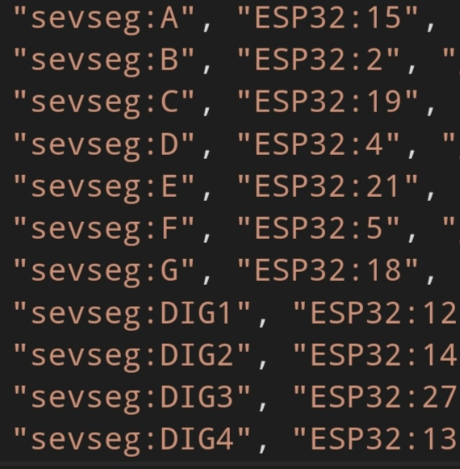

# Micropython Seven segment display control
A micropython module for interfacing with Seven segment display.

This MicroPython module simplifies working with seven-segment displays on different microcontroller boards. It's compatible with 1 to 4 digit displays and has been thoroughly tested on ESP32 with a 4-digit seven-segment display, ensuring easy integration and reliable performance for your projects.

## Example:
This is an example code for a 30 second timer using a common anode 4 digit display:
```python
import micropython_7seg

segments=micropython_7seg.Sevseg("anode")

segments.anode(13,27,14,12)
segments.cathode(15,2,19,4,21,5,18)

segments.count_down(30)
```

###### Example pin connection

**Link of this*simulation:[wokwi](https://wokwi.com/projects/389807478874552321)**


###### Example simulation


## Installation
Use mip (Micropython package manager) to install this module by importing mip in your micropython interpreter.

```python
import mip
mip.install("github:AthulNoobie/micropython_7segment_display_library")
```
## Usage
### 1) Importing the module
```python
import micropython_7seg

#After importing the module, create an object called "segments"(You can give any name).

segments = micropython_7seg.Sevseg("anode")
#Enter "cathode" if you are using a common cathode display.
```
### 2) Set up the pin configuration:

If you are using a common anode display, The anodes are controlling the digits and cathodes are controlling the segments. It is vice versa in common cathode display.
#### In common anode display:


```python
segments.anode(digit4_pin, digit3_pin, digit2_pin, digit1_pin)
#Anode configuration

segments.cathode(A-pin, B-pin, C-pin, D-pin, E-pin, F-pin, G-pin)
#Cathode configuration
```

#### In common cathode display:

```python
segments.cathode(digit4_pin, digit3_pi, digit2_pin, digit1_pin)
#Cathode configuration

segments.anode(A-pin, B-pin, C-pin, D-pin, E-pin, F-pin, G-pin)
#Anode configuration
```

### 3) To display a digit:
```python
segments.display(2024)

#This will display the digit 2024
```
### 4)Count down/up

You can use the count_down() method for both count down and count up.

Default function of count_down() is decrementing the input with a delay of 1 second. **But you can modify it:**

**count_down(initial,final=0,delay=1, decrement=-1)**.This is the default structure.

##### Default usage:
```python
segments.count_down(30)

#This will do a countdown from 30 to 0.
```
##### Modified usage:
```python
segments.count_down(30,20,1,-2)

#This will do a cout_down from 30 to 20 by decrementing 2 with a delay of 1 sec. Like this:
30,28,26,24,22,20
```
##### Count up:
Use the decrement as 1 for count up and -1 for count down.
```python
segments.count_down(30,41,1,1)

#This will do a count up from 30 to 40
```
